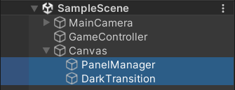
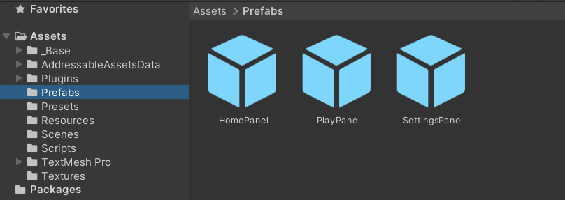
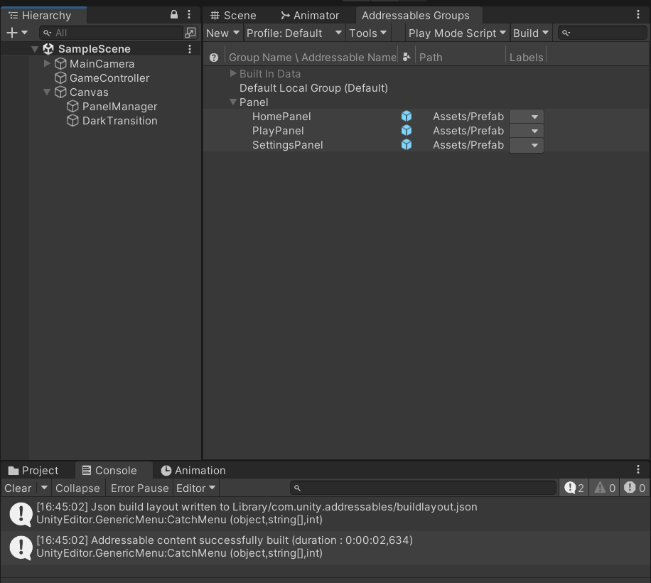
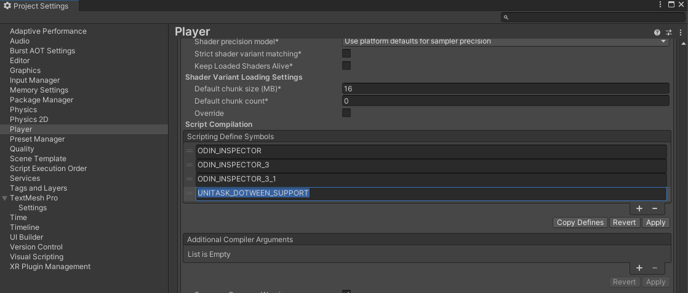
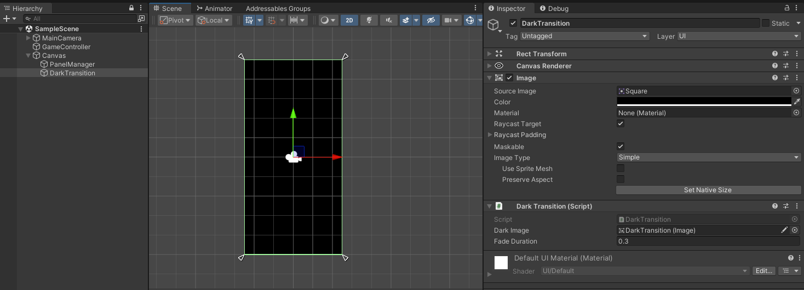

# UI-Manager

- Quản lý các màn hình trong game với cơ chế Stack.
- Có thể sử dụng vuốt nút back ở android để đóng 1 màn hình hiện tại (nếu canBack: true).
- Các màn hình được sinh ra khi cần, và destroy đi khi đã bị đóng.
- Sử dụng Addressables để await sinh 1 màn hình hoặc chờ đợi nó đóng/mở hoàn tất.
- Basic DarkTransition: 1 màn hình đen đơn giản fade in/out để chuyển qua 1 màn hình khác. Thường có nhiều tác vụ cần phải xử lý sẽ được await khi màn hình đã đen hoàn toàn, làm game tự nhiên hơn.

### Requirements

- UniTask
- DOTween
- Odin Inspector
- Addressables

Tải nhanh UniTask và Addressables, thêm vào **manifest.json**

```json
  "com.unity.addressables": "1.21.20",
  "com.cysharp.unitask": "https://github.com/Cysharp/UniTask.git?path=src/UniTask/Assets/Plugins/UniTask#2.5.3",
```

### Setup

- PanelManager sẽ sinh ra các màn hình bên trong nó.
- DarkTransition nằm dưới cùng Canvas để có thể che toàn bộ màn hình game lúc chuyển màn.
- Ban đầu sẽ không có sẵn panel nào trên scene cả, mà mình sẽ sinh ra thông qua code.



- Tạo prefab cho các panel, tên prefab (_là key để có thể dùng Addressables_) thường là tên class của panel đó luôn nhé.
- Các panel này phải có script kế thừa từ class Panel
  - Có sẵn 2 loại panel có thể dùng luôn nếu màn hình này không custom gì
    - Panel: animation fade đơn giản
    - PopupPanel: animation fade BG & scale popup
  - Viết script kế thừa Panel và thêm hàm, biến, xử lý custom tuỳ ý ...



- Build Addressables Data: `Window/Asset Management/Addressables/Groups`
  - Chuột phải -> `Create New Group/Packed Assets`
  - Rename group thành **Panel** rồi kéo các cái prefab panel vào
  - Chuột phải -> `Simplify Addressable Names`
  - Cuối cùng là `Build/New Build/Default Build Script` mỗi khi thêm mới panel nào vào đây.



### Code

- **Create Panel**: về cơ bản thì đầy đủ 1 lệnh CreatePanel sẽ như này.

  - `Create<T>`: thì `T` là kiểu class của panel này. Các hàm Open, Close, Setup ... sẽ được gọi từ class này.
  - `panelName`: là 1 string định danh cho panel này. Trước hết nó là key dùng để instantiate bằng Addressables. Sau đó là dùng để tìm và đóng 1 panel dựa vào tên panel (trình bày phía dưới).
  - `canBack`: có cho phép back trở về panel trước từ panel này không (KeyCode.Escape = Android Back)
  - `onSetup`: là callback sẽ được gọi sau khi panel được sinh ra và chưa Open, thường để xử lý các logic truyền dữ liệu từ màn hình này qua màn hình kia.
  - `autoOpen`: sinh ra panel xong có tự động mở luôn không. Thường là true (dưới có ví dụ về cách tạo ra và sử dụng sau chứ không open ngay)

```C#
// VD create & open panel
int level = 10;

await PanelManager.Instance.CreatePanel<PlayPanel>(
    panelName: "PlayPanel",
    canBack: false,
    onSetup: panel => panel.Setup(level), // default = null
    autoOpen: true // default = true
);
```

```C#
// VD create panel ngắn gọn
await PanelManager.Instance.CreatePanel<PlayPanel>(
    panelName: "PlayPanel", canBack: false
);

// tạo và bỏ qua việc await: sử dụng Forget()
PanelManager.Instance.CreatePanel<PlayPanel>(
    panelName: "PlayPanel", canBack: false
).Forget();
```

- **Open Panel**: dùng khi panel đã được tạo trước đó rồi, tìm tới và Open nó lên
  - `panelName`: tên của panel cần mở
  - `waitOpenCompleted`: await panel open xong (thường thì cũng ít dùng)

```c#
// create PlayPanel, but not open
await PanelManager.Instance.CreatePanel<PlayPanel>(
    panelName: "PlayPanel",
    canBack: false,
    autoOpen: false
);

// do something else ...

await PanelManager.Instance.OpenPanel(
    panelName: "PlayPanel",
    waitOpenCompleted: true // default = false
);

// do something when PlayPanel is opened
```

- **Close Panel**:
  - `panelName`: tên của panel muốn đóng
  - `immediately`: (mặc định là false)
    - false thì show animation của panel.Close()
    - true thì đóng panel ngay, không có animation
  - `waitCloseCompleted`: await panel close xong (thường thì cũng không dùng)

```c#
// VD close panel đầy đủ
await PanelManager.Instance.ClosePanel(
    panelName: "PlayPanel",
    immediately: false, // default = false
    waitCloseCompleted: false // default = false
);
```

```c#
// VD close panel ngắn gọn
await PanelManager.Instance.ClosePanel("PlayPanel");

// 2 lệnh này như nhau, vì await chỉ có tác dụng khi waitCloseCompleted = true
PanelManager.Instance.ClosePanel("PlayPanel").Forget();
```

```c#
// VD await close panel hoàn tất rồi thực hiện tiếp
await PanelManager.Instance.ClosePanel(
    panelName: "PlayPanel",
    waitCloseCompleted: true
);

// do something when PlayPanel closed
```

### DarkTransition (Giới thiệu thêm)

- Mình thường dùng hiệu ứng chuyển màn đơn giản là Fade In / Fade Out 1 màn hình đen
- Thường thì dùng ở những nơi chuyển màn lớn thôi, như từ Home -> Play hoặc ngược lại.

- Thêm `UNITASK_DOTWEEN_SUPPORT` trong Project Settings để dùng được Tween.ToUniTask()



- Setup inspector như sau: tạo 1 image đen full màn (có tick RaycastTarget để chặn tương tác với panel hiện tại trong quá trình Transition)



- Ví dụ cách dùng:

```c#
// TransitionAsync đối với các công việc cần await, và sẽ được xử lý khi màn hình game đã đen hoàn toàn.
DarkTransition.Instance.TransitionAsync(async () =>
{
    // close immediately home panel
    await PanelManager.Instance.ClosePanel(
        panelName: "HomePanel",
        immediately: true
    );

    // create play panel when screen is full dark
    await PanelManager.Instance.CreatePanel<PlayPanel>(
        panelName: "PlayPanel",
        canBack: false,
        onSetup: panel => panel.Setup()
    );
});
```
